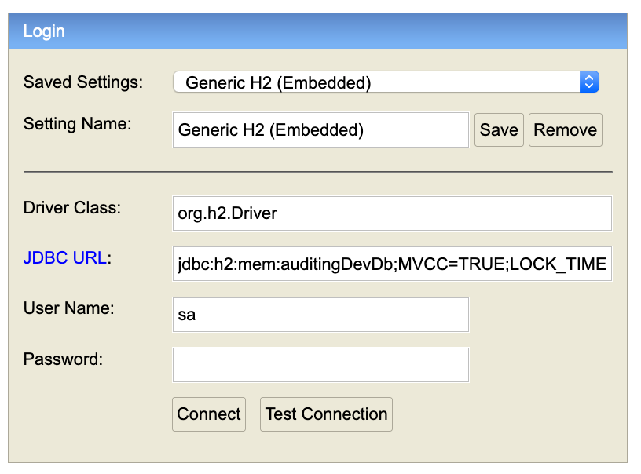

# Grails Audit Logging Sample Applications #
 
This repository holds sample audit-logging applications in different branches to show the functionality of the Grails Audit-Logging plugin in action.
They can be used by users to quickly verify functionality.

* The Domain actions are mostly performed in the Boostrap class. You can then use your browser to check the auditController list of events logged.
* Most of the applications are secured by Spring Security (user: me, password: password)

## master branch: single datasource

 * One common H2 Datasource for all domain classes 

## grails_3.3.x branches
 * multiple H2 db DataSources
 * Auditing to 2nd datasource
 * Auditing domains in Bootstrap.groovy

## mongoDbOnlyDatasource branch: MongoDB as only DataSource
For the MongoDB as single datasource example project, see branch [mongoDbOnlyDatasource](https://github.com/robertoschwald/grails-audit-logging-plugin-examples/tree/mongoDbOnlyDatasource)

## Configuration
 
 - H2 as the DataSource(s)
 - Hibernate dependencies
 - Spring-Security-Core to secure the pages and to get the actor in AuditLog (some branches)
 - database-migration to setup the schema (some branches)
 
## Dependencies
 * See the branches build.gradle / BuildConfig.groovy

## Datasource
 This examples use H2 Database(s).
 
 See grails-app/conf/application.yml for config details


## Starting the application
 * Checkout this source branch from GitHub
 * Change into the source-directory
 * Start the application: 
 
```
 grails run-app
```
 * Access http://localhost:8080
 * H2 console on http://localhost:8080/dbconsole
  * To access the auditing datasource, enter the db url:
  * jdbc:h2:mem:auditingDevDb;MVCC=TRUE;LOCK_TIMEOUT=10000;DB_CLOSE_ON_EXIT=FALSE




